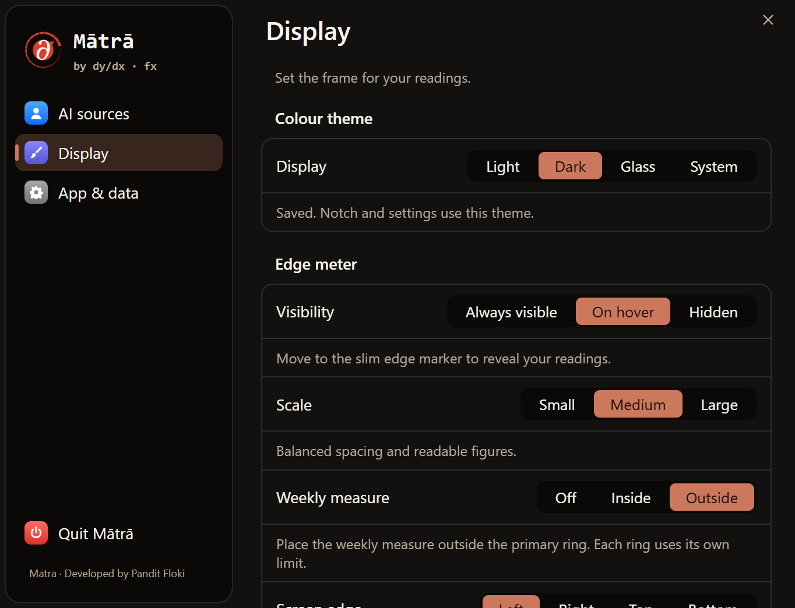

# Mātrā


**AI usage, in proportion.**

The v1.8.1 Windows installer includes Logo-18, the DYDXFX colour themes and the
updated Settings vocabulary. No PowerShell command or developer tools are needed.



Settings UI preview with sample data, not a live account or native blur capture.
See the [branding review](docs/BRANDING-REVIEW.md) for light theme, AI sources,
App & data, and the proposed vocabulary.

**मात्रा** — *measure*. A lightweight AI usage and activity notch for Windows.

It stays folded into the edge of your desktop, opens on hover, and shows the limits that matter
without becoming another dashboard window. Rings show quota pressure; the hover card explains
each limit window and reset time; live activity shows whether an agent is working or waiting.

## Download for Windows

### [Download Mātrā v1.8.1 for Windows](https://github.com/panditfloki/matra/releases/latest/download/Matra-Setup.exe)

The installer is named `Matra-Setup.exe` in every release, so this link always points to the newest
Windows build. It installs for the current user and does not require administrator rights.

Download and double-click **Matra-Setup.exe**, complete Setup, then launch Mātrā
from the finish page or Start menu. The app's `matra.exe` is not an installer.
Setup migrates old Mātrā preview processes and shortcuts, and keeps your existing
theme, provider preferences and enabled integrations. Fresh installs follow the
Windows theme; choose Light, Dark, Glass or System in **Display**.

The current installer is not code-signed. Windows SmartScreen may show **Windows protected your
PC** on first launch; choose **More info → Run anyway**. Source and build workflow are public here.

## What Mātrā watches

| Provider | Reading |
|---|---|
| Claude Code | Session and weekly limits, account-aware activity and attention state |
| Codex | Primary and weekly limits, including additional reported buckets |
| Cursor | Included usage, API usage and billing-cycle reset |
| Antigravity | Gemini/Claude/GPT quota lanes from the official CLI when available |
| Grok | Weekly Grok Build allowance from the signed-in CLI session |
| GLM | Z.ai Coding Plan utilization |

Providers that are not installed or signed in stay out of the notch. Missing data is shown as
missing—not invented as zero.

## Product design

- A thin edge notch at rest; compact, readable expansion on hover.
- System, Light, Dark and DYDX FX glass appearances.
- Left, right, top or bottom placement with per-edge position memory.
- Small, medium and large sizes, optional weekly rings, tray controls and startup support.
- Separate hover-revealed move and settings controls, without permanent desktop clutter.
- Local-first provider reads. Credentials are borrowed from the tools that own them and are never logged.

Mātrā's Windows app is adapted from the MIT-licensed Windows implementation in
[CodeNotch](https://github.com/vinzdg/codenotch). The inverse-notch interaction, provider semantics
and upstream notices are retained; Mātrā adds its own identity, isolation, DYDX FX themes, glass
design and Windows release path. Exact provenance is recorded in [`native/UPSTREAM.md`](native/UPSTREAM.md).

## Build the native app

```powershell
npm run native:test
npm run native:build
npm run native:bundle
npm run native:install
```

The native source is under `native/`. The older Electron experiment remains under `desktop/` for
history and is not the selected Windows implementation.

---

## Legacy VS Code and local-web dashboard

The original extension remains in this repository for existing users. It runs inside VS Code,
Cursor, Antigravity or Windsurf, and can also run as a local web app at `localhost:4317`.

## It uses *your* account, automatically

There is nothing to configure and no API key to paste. Everything is read at runtime from
your own machine:

| What | Where it comes from |
|---|---|
| Plan quota, reset times, tier | **Your** Claude Code OAuth token, from the OS credential store |
| Costs, tokens, models, projects | **Your** local transcripts, `~/.claude/projects/**/*.jsonl` |
| Codex tokens, models, sessions, directories | `ccusage codex … --json` over `~/.codex/sessions/**/*.jsonl` |
| Codex plan limit and reset | Latest local Codex `token_count.rate_limits` record |
| Gemini quota, tokens, cost | Antigravity's own local Connect-RPC service + its SQLite conversation logs — see *Gemini* below |
| USD⇄INR conversion (only if you turn on the ₹ toggle) | `open.er-api.com`, the one outbound call this tool makes that isn't to Anthropic |

Your token never leaves your machine, is never logged or written to disk, and is sent nowhere
except `api.anthropic.com`. Clone it, run it, and you see *your* usage against *your* plan.

Codex support never reads ChatGPT browser history or credentials. It covers **Codex only**;
ordinary ChatGPT web/app conversations are not included. Codex USD is equivalent API cost — a
burn proxy, not a ChatGPT Plus bill.

## Install

Requires **Node 18+** and a logged-in **Claude Code**.

Codex history is optional. Install [`ccusage`](https://github.com/ryoppippi/ccusage) globally to
enable it; if the command is absent or fails, Claude continues working and the Codex view shows an
explicit unavailable state.

**Option A — install the extension** (no build step). Grab the `.vsix` from the
[latest release](https://github.com/panditfloki/matra/releases/latest):

```bash
code --install-extension claude-usage-meter-0.9.0.vsix
# or: cursor --install-extension … · antigravity-ide --install-extension …
```

Or from the IDE: **Extensions → ⋯ → Install from VSIX…**

**Option B — run the web app**, no IDE at all:

```bash
git clone https://github.com/panditfloki/matra
cd matra
node server.js          # → http://localhost:4317
```

The web app binds **loopback only** (`127.0.0.1`). It shows your plan tier, quota percentages
and spend, so it is not something to put on a network by accident. To reach it from another
device on purpose:

```bash
MATRA_HOST=0.0.0.0 node server.js    # deliberate LAN exposure
PORT=4318 node server.js             # different port
```

**Build the extension yourself** (if you'd rather not trust a binary):

```bash
npx @vscode/vsce package --allow-missing-repository
code --install-extension claude-usage-meter-*.vsix
```

Optionally `cp plan.example.json plan.json` and fill in your plan cost and renewal date —
see *What it cannot know* below. Skip it and those tiles simply don't appear.

## Platform support

| OS | Quota bars | Everything else |
|---|---|---|
| **macOS** | ✅ reads Keychain item `Claude Code-credentials` | ✅ |
| **Linux** | ✅ falls back to `~/.claude/.credentials.json` | ✅ |
| **Windows** | ✅ same `~/.claude/.credentials.json` fallback | ✅ |

**Windows quota bars work.** This table used to say *"❌ untested — credentials are stored
differently"*, and that was wrong: win32 takes the same `.credentials.json` path as Linux, and
real plan/session/weekly numbers have now been read on three separate Windows machines. If you
were put off by the old caveat, it cost you nothing but the caveat.

Two optional companions are looked up on `PATH`, and each is independent:

| You want | You need | Without it |
|---|---|---|
| Codex history | [`ccusage`](https://github.com/ryoppippi/ccusage) | Codex panel says so plainly |
| Gemini tokens/cost | `sqlite3` | Gemini panel says so plainly |

⚠️ On Windows, installing either **does not** help a Mātrā that is already running — a process
inherits its parent's environment, not the registry. Restart it after installing.

---

## Two data sources, and they are not the same

**1. Real plan quota — `GET /api/oauth/usage`.** Session %, weekly %, per-model weekly %,
reset times, plan tier. These are the true server-side numbers — the same ones Claude Code's
own `/usage` command reports, and the only figures here that are not derived.

> ⚠️ **This endpoint is internal and undocumented.** Anthropic can change or remove it in any
> Claude Code release, and it rate-limits aggressively (it exists for on-demand `/usage`, not
> polling — hence the 15-minute cache and the shared on-disk cache between processes). Every
> failure path is deliberately soft: a 429 or a 404 serves the last good reading marked
> *"as of 4m ago"*, and if there has never been one, the bars simply hide. **The quota
> disappearing must never take the rest of the dashboard down with it.**

**2. Everything else — your local transcripts.** Costs, token counts, models, projects,
sessions, streaks, heatmap. No network, no credentials, cannot break.

**Costs are *equivalent API cost* — a burn proxy, not a bill.** On Max you pay a flat fee.
This tells you which project is eating your window; it is not an invoice. It is labelled that
way on the dashboard, everywhere it appears.

## What it cannot know

The Claude Code OAuth token carries scopes `user:profile`, `user:inference`,
`user:sessions:claude_code`, `user:mcp_servers`, `user:file_upload` — and **no billing scope**.
So plan price, renewal date, credit balance, and invoice history are simply not fetchable.

Those live in `plan.json` (gitignored), and every value from it renders on a **dashed tile
tagged "declared"** — never as if it were live. A number you must remember to update *will* go
stale, and a dashboard that hides which numbers those are is a dashboard that lies.

The one thing that *does* self-populate: **usage credits**. `spend` in the API response is that
object (`balance` / `used` / `cap` / `auto_reload`). It reads null while credits are disabled;
enable them and the tiles fill in with no code change.

## Gemini / Antigravity

Reads locally, from two places that need Antigravity to be running at least once:

- **Quota %** — the exact RPC Antigravity's own UI calls
  (`RetrieveUserQuotaSummary`), reached the same way `quota.js` reaches Claude's:
  read a credential the running process already holds (its `--csrf_token`,
  found via `ps`/`lsof`), then call the real local endpoint with it. The token
  is sent only to a port that has already proven, unauthenticated, that it
  speaks this RPC — Antigravity forwards other local ports (yours, and this
  tool's own `:4317`) through the same process, and those answer HTTP 200 too.
- **Tokens and cost** — decoded from `gen_metadata` in Antigravity's own SQLite
  conversation logs (`~/.gemini/antigravity-cli/conversations/*.db`), using the
  protobuf schema recovered from its `language_server` binary.

**The two halves have different requirements — do not read one limit as both:**

- **Quota %** is **macOS and Linux only**, because finding the running
  `language_server` and its `--csrf_token` uses `ps`/`lsof`. Windows is refused
  with that reason stated up front, never silently reported as zero usage.
- **Tokens and cost** work anywhere `sqlite3` is on `PATH`, **Windows included**
  — verified there against the raw `gen_metadata` row counts.

Either half being unavailable is always *stated*, never rendered as a zero. A
missing reading and a real zero are different facts and this tool keeps them apart.

## Currency toggle (₹ / $)

Every dollar figure can be shown converted to rupees. The conversion happens
only at render time — nothing stored is ever rewritten — using a mid-market
USD→INR rate fetched from `open.er-api.com` (free, no key, no signup) and
cached for 12 hours, since the upstream itself only publishes once a day. A
`forexMarkupPercent` in `plan.json` accounts for what your card is actually
charged over mid-market. A rate that has never been fetched, or has gone
stale past the cache window, leaves the toggle showing dollars rather than
converting with a guess.

## Two parsing traps (both cost real money if you get them wrong)

If you write your own parser for Claude Code transcripts, these will bite you. They bit me.

1. **Subagent transcripts sit three directories deep** — `<project>/<session>/subagents/`.
   A one-level directory walk silently drops every subagent turn. That was ~$37 and 171 turns
   of real usage, invisible.
2. **A streaming message's usage row is rewritten as it grows.** The same `message.id` appears
   several times with an *increasing* `output_tokens` — one real case went `7 → 7 → 7 → 955`.
   Dedupe must keep the **highest-output** row per id, not the first, or output — the priciest
   token class — is badly undercounted.

## Architecture

`parser.js` and `quota.js` are deliberately **UI-agnostic** — the same two modules drive both
the VS Code webview and the standalone web app, and `media/dashboard.html` is a single file
that detects which host it is running in. Import them; don't fork them.

```
parser.js   local transcripts → costs, tokens, models, projects, heatmap   (no network)
quota.js    /api/oauth/{usage,profile} → real plan limits                  (soft-fails)
codex.js    ccusage history + latest local Codex plan limit                (soft-fails)
gemini.js   Antigravity RPC + SQLite logs → quota, tokens, cost            (soft-fails)
fx.js       open.er-api.com → USD⇄INR rate, 12h cache                     (soft-fails)
extension.js  status bar + webview panel
server.js     the same dashboard over HTTP
media/dashboard.html   one page, two hosts
```

## Commands & settings

- `Mātrā: Open Dashboard` · `Mātrā: Refresh Now`
- Refreshing a provider from either the IDE panel or localhost updates the shared cache; both
  surfaces redraw without making a second provider request.
- Status-bar settings include compact/full reset-time display, warning/error thresholds, and
  optional local aliases for Claude and Codex accounts.
- `claudeUsage.statusBar.metric` — `quota` (default) · `cost` · `today` · `total`
- `claudeUsage.statusBar.show`

## Licence & contact

MIT — © 2026 [dydxfx](https://dydxfx.com). Not affiliated with Anthropic.

Built by **Pandit Floki** at **dydxfx** · [dydxfx.com](https://dydxfx.com) · <pandit@dydxfx.com>

Issues and PRs welcome on [GitHub](https://github.com/panditfloki/matra/issues).
