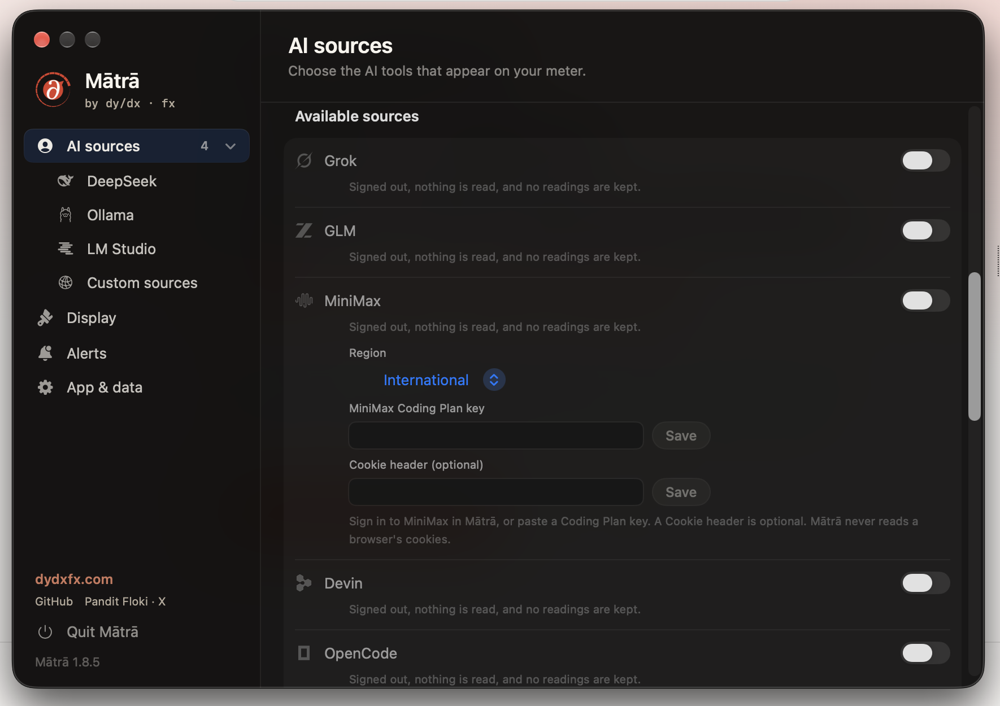
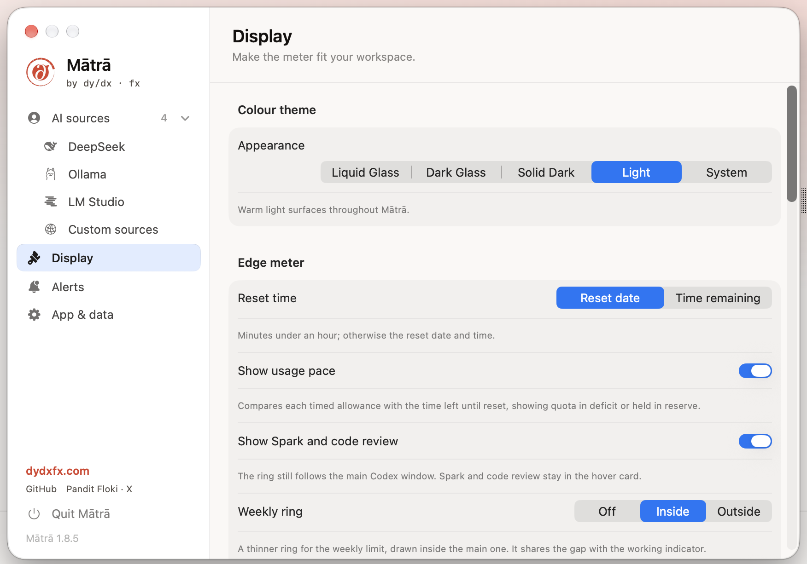
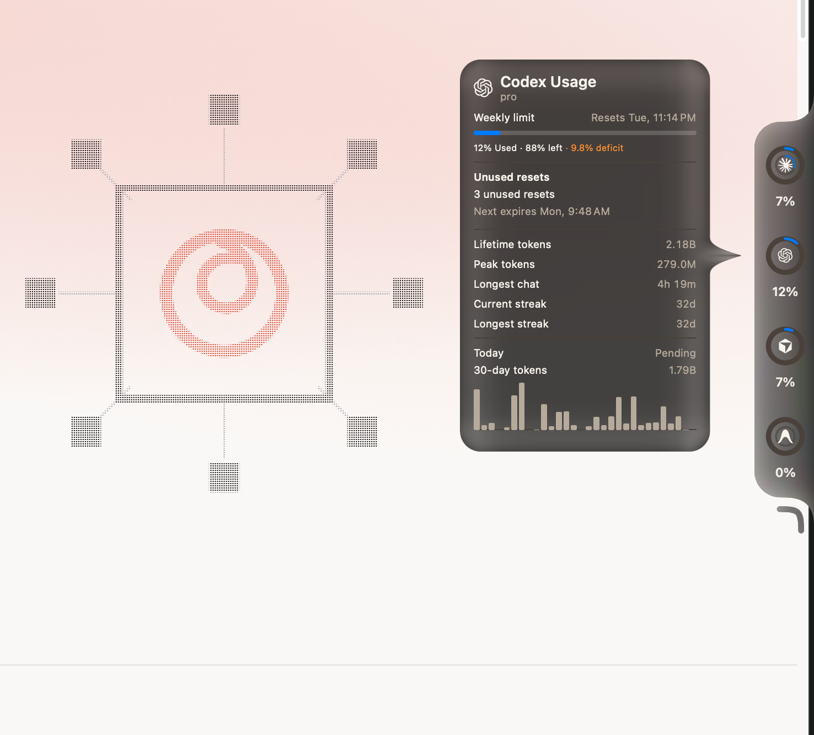

<p align="center">
  
</p>

<h1 align="center">Mātrā</h1>

<p align="center"><strong>AI usage, in proportion.</strong><br>
Your AI limits, at the edge of your screen.</p>

<p align="center">
  <a href="https://github.com/panditfloki/matra/releases/download/v1.8.4/Matra-Setup.exe">Windows · v1.8.4</a> ·
  <a href="https://github.com/panditfloki/matra/releases/tag/v1.8.5-macos-beta.1">macOS · v1.8.5 Beta 1</a> ·
  <a href="#a-closer-look">Screenshots</a> ·
  <a href="#availability">Release status</a> ·
  <a href="https://dydxfx.com">DYDXFX</a>
</p>

Mātrā (मात्रा, *measure*) is a compact desktop meter for people who work across
AI tools. See usage, remaining allowance and reset times without opening another
dashboard. It folds into your screen edge and opens when you need the detail.

<p align="center">
  <a href="docs/screenshots/macos-codex-glass.png">
    
  </a>
</p>

<p align="center"><sub>macOS v1.8.5 beta. Actual readings at capture time; screenshots do not update live.</sub></p>

## A glance, then the detail

- **One compact meter.** Keep supported AI accounts together at the screen edge.
- **Rings for the overview.** See the main allowance and, where available, a separate weekly ring.
- **Hover for context.** Open the provider card for limit windows, remaining usage and reset times.
- **Activity beside usage.** See supported agents working, waiting or idle.
- **Your workspace, your layout.** Choose placement, size, visibility and appearance.
- **Unknown means unknown.** Missing readings are not presented as zero usage.

## A closer look

<table>
  <tr>
    <td width="50%"><strong>Choose your AI sources</strong><br>Keep the meter focused on the tools you use.</td>
    <td width="50%"><strong>Make it fit your workspace</strong><br>Choose a theme, reset format and ring layout.</td>
  </tr>
  <tr>
    <td><a href="docs/screenshots/macos-sources-dark.png"></a></td>
    <td><a href="docs/screenshots/macos-display-light.png"></a></td>
  </tr>
</table>

These screenshots show the **macOS v1.8.5 beta build**, captured on
30 September 2026. The Windows download is a separate release; the screenshots
do not imply that every Mac feature is already available on Windows.

<details>
<summary>View the alternate Codex screenshot and capture notes</summary>



The two Codex captures show the same view with slightly different framing.
The blue usage arcs visible here precede the updated status-colour behaviour:
app accents now belong to controls, while usage colours communicate allowance
pressure. Values and availability depend on each provider and account.

</details>

## Availability

| Platform | Download | Development |
|---|---|---|
| **Windows** | [v1.8.4 stable installer](https://github.com/panditfloki/matra/releases/tag/v1.8.4) | v1.8.5 is being developed and tested separately on Windows |
| **macOS** | [v1.8.5 Beta 1 for Apple Silicon](https://github.com/panditfloki/matra/releases/tag/v1.8.5-macos-beta.1) | [Mac source on the beta branch](https://github.com/panditfloki/matra/tree/beta/native/macos) |

Release status checked on **30 September 2026**. Windows stable and macOS beta
have separate downloads and release channels.

### Install on macOS

1. Open the [Mac beta release](https://github.com/panditfloki/matra/releases/tag/v1.8.5-macos-beta.1).
2. Download the **macOS arm64 DMG** and **SHA256SUMS.txt**.
3. Quit Mātrā, open the DMG and drag **Matra.app** into **Applications**.
4. Eject the DMG and launch Mātrā from Applications.

Requires an **Apple Silicon Mac with macOS 15 or later**. Native glass requires
macOS 26; earlier versions use solid surfaces. An Intel installer is not included.
This beta uses the tested developer build and ad-hoc signing. Developer ID signing
and Apple notarization are pending. If macOS blocks installation, stop and review
the warning. Preferences and provider sign-ins are retained when replacing the app.

Beta updates are installed manually. The automatic-install preference is present,
but a published signed update feed and a complete upgrade test are still pending.

### Install on Windows

1. Open the [Windows stable release](https://github.com/panditfloki/matra/releases/tag/v1.8.4).
2. Download **Matra-Setup.exe**. The release also provides **SHA256SUMS.txt**.
3. Run Setup, then launch Mātrā from the Start menu.

The installer is per-user and does not require administrator rights. The current
download is not publisher-signed, so Windows may display a security warning.
Verify the download source and checksum before deciding whether to run it.
A checksum checks file integrity; it is not a publisher signature.

Already installed? Check **App & data** for update controls. Automatic installation
and the new cross-platform design are still part of the v1.8.5 work, not a promise
about the v1.8.4 download.

## Supported readings

The published Windows app includes these integrations. Available fields depend
on the provider, plan, installed tool and signed-in session.

| Source | What Mātrā can show |
|---|---|
| Claude Code | Session and weekly limits, reset times, supported activity states |
| Codex | Reported primary/weekly allowances and additional limit buckets |
| Cursor | Included usage, API usage and billing-cycle resets |
| Antigravity | Reported Gemini, Claude and GPT model-group allowances |
| Grok | Weekly allowance from the signed-in CLI session |
| GLM | Z.ai Coding Plan utilisation |

The Mac beta includes additional source options. A source appearing in Settings
does not guarantee that its service exposes every metric.

**Codex is not all of ChatGPT.** Ordinary ChatGPT browser and app conversations
are not included. Quota percentages, token counts and cost estimates are different
readings; an estimated API cost is not your subscription bill.

## Appearance with a purpose

The Mac beta offers **Liquid Glass, Dark Glass, Solid Dark, Light and System**.
Glass depends on platform support and falls back to an opaque surface where needed.

In the updated Mac build, accent colours personalise app controls without changing
the meaning of quota colours:

| Used allowance, default thresholds | Status colour |
|---|---|
| Below 50% | Green |
| 50% to below 70% | Amber |
| 70% to below 90% | Orange |
| 90% and above | Red |
| Unavailable | Neutral grey |

Mac Watch and Critical thresholds are adjustable. Red takes priority from 90%.
Notification settings are separate. The next Windows app is being developed to
match this visual direction; its new features remain subject to Windows testing.

## Data and privacy

Mātrā reads supported provider sessions, local usage records and provider APIs.
It does not require a separate Mātrā account or route your usage through a
Mātrā-hosted service.

- Credentials are used with the provider that owns them. Some integrations need
  an explicit sign-in or API key.
- Data freshness varies. Cached, unavailable and expired-session states must be
  read as such, not as real-time guarantees.
- Some provider endpoints are undocumented and may change.
- GitHub is contacted for app updates.

The legacy dashboard has its own data paths, including an optional USD/INR rate
request. See the [legacy guide](docs/LEGACY-DASHBOARD.md).

## For developers

The selected Windows implementation is native Rust/Tauri. The older Electron
experiment under `desktop/` is not the shipping Windows app.

On Windows, with the Rust/Tauri build prerequisites installed:

```powershell
npm run native:test
npm run native:build
npm run native:bundle
```

See [native build notes](native/README.md) and the
[Windows workflow](.github/workflows/windows.yml).
The Mac beta uses Swift/AppKit. Build instructions, pinned dependencies and source
are available in [the Mac beta source](https://github.com/panditfloki/matra/tree/beta/native/macos).

### Existing IDE and localhost users

The original VS Code-compatible extension and `localhost:4317` dashboard remain
available in this repository. Their installation, data sources, currency settings
and architecture are documented in the [legacy guide](docs/LEGACY-DASHBOARD.md).

## Latest versions

| Platform | Latest downloadable version | Channel | Package |
|---|---|---|---|
| **Windows** | **1.8.4** | Stable; 1.8.5 development in progress | [Matra-Setup.exe](https://github.com/panditfloki/matra/releases/download/v1.8.4/Matra-Setup.exe) |
| **macOS** | **1.8.5 Beta 1** | Beta · Apple Silicon · macOS 15+ | [Mac beta installer and checksum](https://github.com/panditfloki/matra/releases/tag/v1.8.5-macos-beta.1) |

Updated **30 September 2026**. App settings on Mac report version 1.8.5, build 185.

---

Built by **Pandit Floki** at **DYDXFX**.

© 2026 dydxfx · https://dydxfx.com

[dydxfx.com](https://dydxfx.com) ·
[GitHub](https://github.com/panditfloki) ·
[X](https://x.com/panditftw) ·
[Report an issue](https://github.com/panditfloki/matra/issues)

[MIT licence](LICENSE). Independent project; not affiliated with the AI providers.
