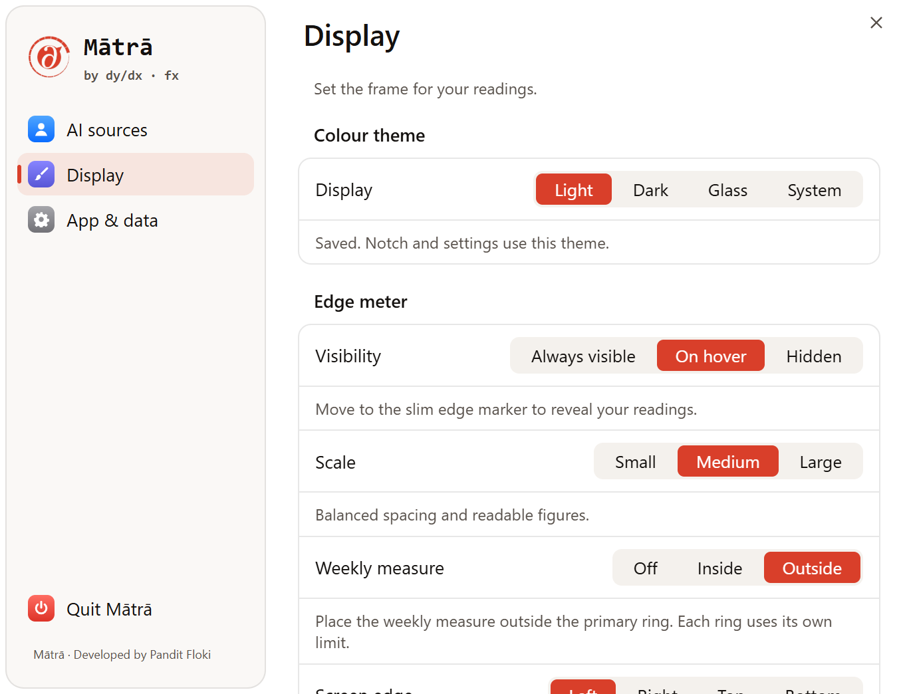
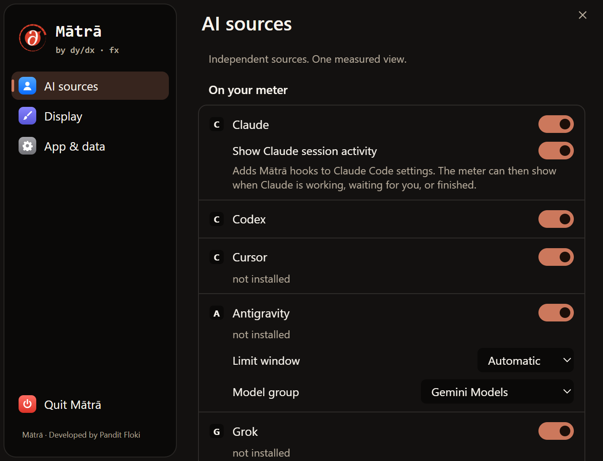
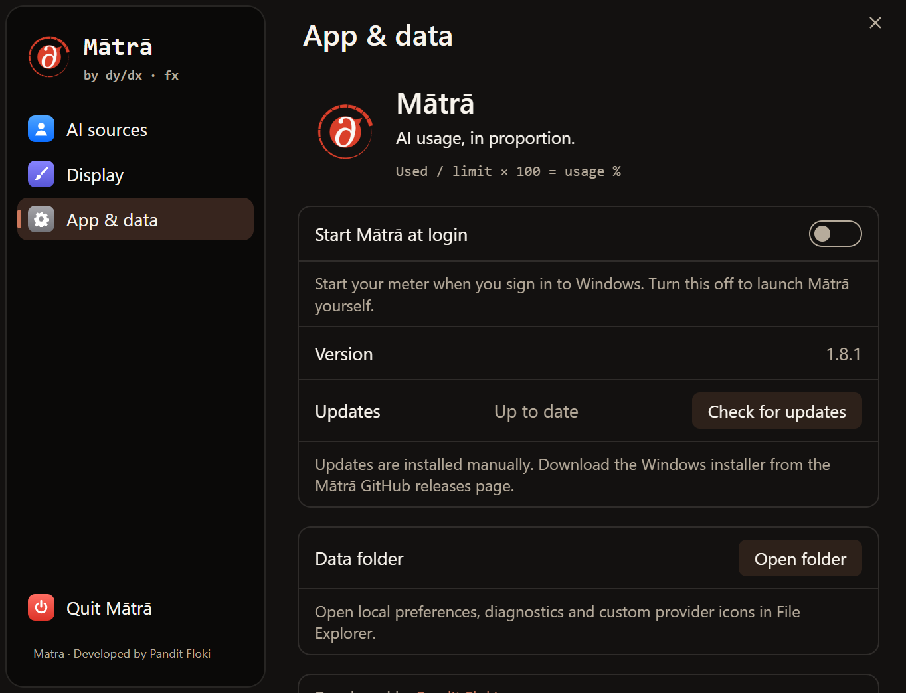

# Logo-18 and Settings copy: local review

Status: approved by the user on 22 September 2026 for publication to GitHub.
Packaged in v1.8.1. The Windows setup includes the approved assets and copy.
Existing installations need the new installer; a GitHub source push alone does
not update them.

## Identity

Approved artwork: [Logo-18](../media/brand/matra-logo-18.png).
The supplied meter and DYDXFX mark are preserved, not regenerated.
ICO sizes: 16, 20, 24, 32, 48, 64, 128 and 256 pixels.
Tray and Settings assets derive from the same master.
Fine ring segments need a final visual check on the actual Windows taskbar.

## Approved tagline

**AI usage, in proportion.**

This links usage percentages to the mathematical DYDXFX identity without claiming
to measure model intelligence, productivity or money saved.

Alternatives:

- **A measure of your AI.** Shorter, but can imply quality evaluation.
- **Know your limits. Keep your flow.** Clear benefit, less distinctive mathematical character.

Research on 22 September 2026:

- [DYDXFX](https://dydxfx.com): “Performance is a derivative.” and the derivative/function identity inform the mathematical tone.
- [TokenKarma](https://tokenkarma.app/ai-usage-tracker): quota-tracker positioning already emphasizes limits in one place.
- [UsageScope](https://usagescope.com): emphasizes visibility and uninterrupted work.

An exact-phrase search did not surface an obvious identical tagline. This is not
trademark clearance or an exhaustive originality check.

## Settings vocabulary

| Previous | Approved |
|---|---|
| Accounts | AI sources |
| Appearance | Display |
| General | App & data |
| Connected | On your meter |
| Not connected | Available sources |
| Notch | Edge meter |
| Show | Visibility |
| Size | Scale |
| Weekly ring | Weekly measure |
| Show move handle | Enable drag handle |
| Recentre | Centre meter |

Practical controls stay literal. Introductory text carries the mathematical tone.
The explanatory formula is `Used / limit × 100 = usage %`, independently for each
reported limit window. Different provider limits must not be added together.
Glass is described as translucent smoke tint, not verified desktop blur.
Existing non-English translations remain; this is an English-copy pass.
CodeNotch attribution and license notices remain intact.

## UI previews

These render the real Settings HTML in an isolated Electron preview with sample
data. They are not native-window, desktop-blur or live-provider verification.

Screenshots use sample data, not live account readings. v1.8.1 is a separate patch
release; the older release installer is not silently replaced.
